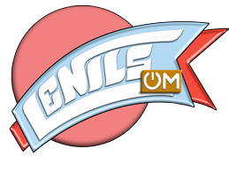

# 🥳 Seja bem vindo(a) ao meu repositório!!!👍

#### Readme em construção
Testando imagem 
Testando links 
[meu perfil no LinkedIn](https://www.linkedin.com/in/silvalenilsom/) 
<a href="https://www.linkedin.com/in/silvalenilsom/" target="_blank">
  [linkedIn](https://img.shields.io/badge/LinkedIn-0077B5?style=for-the-badge&logo=linkedin&logoColor=white)
</a>

<!--
**silvallenilsom/silvallenilsom** is a ✨ _special_ ✨ repository because its `README.md` (this file) appears on your GitHub profile.

Here are some ideas to get you started:

- 🔭 I’m currently working on ...
- 🌱 I’m currently learning ...
- 👯 I’m looking to collaborate on ...
- 🤔 I’m looking for help with ...
- 💬 Ask me about ...
- 📫 How to reach me: ...
- 😄 Pronouns: ...
- ⚡ Fun fact: ...
-->
